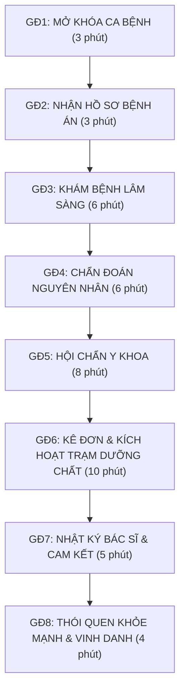

# THIẾT KẾ BÀI GIẢNG (LESSON DESIGN) - TIẾT 1
## BÀI H6.01: THỰC ĐƠN VÀNG CHO TUỔI DẬY THÌ
**Chủ đề:** Em và tuổi dậy thì  
**Mã bài:** H6.01 | **Khối lớp:** Lớp 6  
**Thời lượng:** 01 tiết (45 phút)  
**Theme nhập vai:** Bác sĩ Dinh dưỡng (Nova Hospital Concept)  

---

## I. MỤC TIÊU BÀI HỌC (K-S-A)

### 1. Kiến thức (K)
- Nhận biết được các nhóm chất dinh dưỡng cần thiết cho cơ thể trong giai đoạn tuổi dậy thì; Hiểu rõ nhu cầu năng lượng và sự phát triển thể chất đặc thù của lứa tuổi THCS.

### 2. Kỹ năng (S)
- Áp dụng kiến thức dinh dưỡng để tự thiết kế một thực đơn vàng cân bằng, hợp lý cho bản thân trong 1 ngày.

### 3. Thái độ (A)
- Có ý thức chủ động chăm sóc sức khỏe thể chất, tự giác lựa chọn thực phẩm lành mạnh và hạn chế đồ ăn nhanh.

---

## II. CHUẨN BỊ

### 1. Giáo viên
- 06 Thẻ Bác sĩ Dinh dưỡng tập sự (Phát cho 6 kíp trực y khoa).
- 01 Phiếu in: Phiếu thực hành Đĩa ăn dinh dưỡng (In 06 bản khổ A4 cho 6 kíp trực).
- Máy tính, máy chiếu, bài giảng slide tương tác.

### 2. Học sinh
- Giấy A4, Sổ ghi chép.
- Bút viết, bút màu, hồ dán (cho các kíp trực).

---

## III. TIẾN TRÌNH DẠY HỌC (THEO 8 GIAI ĐOẠN CONCEPT BÁC SĨ V2)

---

### HOẠT ĐỘNG 1: TIẾP NHẬN BÁO ĐỘNG & KHÁM BỆNH LÂM SÀNG TUỔI DẬY THÌ (12 PHÚT)

#### 1. Mã HĐ & Tên HĐ
- **Mã HĐ:** HĐ1
- **Tên Hoạt động:** Tiếp nhận báo động đỏ y khoa & Khám bệnh giải mã thói quen bệnh án tuổi dậy thì

#### 2. Các Giai đoạn Concept Bác sĩ tích hợp
- **GIAI ĐOẠN 1: MỞ KHÓA CA BỆNH (3 phút)**
- **GIAI ĐOẠN 2: NHẬN HỒ SƠ BỆNH ÁN (3 phút)**
- **GIAI ĐOẠN 3: KHÁM BỆNH LÂM SÀNG (6 phút)**

#### 3. Mục tiêu Giai đoạn
- Kích hoạt tinh thần nhập vai Kíp trực Bác sĩ Dinh dưỡng Nova Hospital để giải quyết tín hiệu báo động đỏ.
- Tiếp nhận 3 hồ sơ bệnh án, phân tích triệu chứng mệt mỏi, nổi mụn, béo phì và phát hiện các thói quen sai lầm tổn hại cơ thể tuổi dậy thì.

#### 4. Chuẩn bị
- **Giáo viên:** 06 Thẻ Bác sĩ Dinh dưỡng tập sự, Slide bài giảng tương tác.
- **Học sinh:** Sổ ghi chép, Giấy A4.

#### 5. Hướng dẫn chi tiết Giáo viên & Học sinh

##### GIAI ĐOẠN 1: MỞ KHÓA CA BỆNH (3 phút)
- **Giáo viên (Bác sĩ trưởng khoa):** 
  - Chào mừng học sinh đến với Khoa Dinh dưỡng Nova Hospital.
  - Phân phát Thẻ Bác sĩ Dinh dưỡng tập sự cho 6 kíp trực (6 nhóm).
  - Kích hoạt tín hiệu báo động đỏ: *"Các bác sĩ tập sự chú ý! Khoa Dinh dưỡng vừa tiếp nhận 3 ca cấp cứu của học sinh 12 tuổi gặp bất ổn thể chất nghiêm trọng tuổi dậy thì!"*
  - Giới thiệu Mục tiêu bài học (K-S-A) và Nhiệm vụ chung của bài học trên slide.
- **Học sinh (Kíp trực y khoa):** 
  - Đeo thẻ bác sĩ tập sự, mở Sổ ghi chép, ổn định vị trí 6 kíp trực.

##### GIAI ĐOẠN 2: NHẬN HỒ SƠ BỆNH ÁN (3 phút)
- **Giáo viên:** 
  - Điều phối bốc thăm/phân công tiếp nhận 3 hồ sơ ca bệnh (Nam 12t: mụn nhờn; Linh 12t: hoa mắt; Hoàng 12t: béo phì).
  - Hướng dẫn quy trình 3 bước nghiên cứu bệnh án cho các kíp trực.
- **Học sinh:** 
  - Đọc quy trình 3 bước tác nghiệp trên slide và mở Sổ ghi chép sẵn sàng tiếp nhận dữ liệu bệnh án.

##### GIAI ĐOẠN 3: KHÁM BỆNH LÂM SÀNG (6 phút)
- **Giáo viên:** 
  - Trình chiếu 3 hồ sơ ca bệnh đầy đủ trên slide.
  - Điều phối đại diện kíp trực lên bảng thao tác trực tiếp.
- **Học sinh (Thao tác chi tiết theo 3 bước):**
  - **Bước 1 (Đọc đề bài & Tiếp nhận ca bệnh):** Đọc kỹ 3 hồ sơ bệnh án của Nam, Linh và Hoàng được trình chiếu trên màn hình slide.
  - **Bước 2 (Thảo luận nhóm đôi trong kíp trực):** Thảo luận nhóm đôi, đối chiếu triệu chứng bất ổn thể chất và ghi các từ khóa thói quen có hại vào Sổ ghi chép.
  - **Bước 3 (Trình bày & Đại diện lên thao tác màn hình):** Đại diện các kíp trực lên bảng thao tác trực tiếp trên màn hình slide (bấm chọn các từ khóa thói quen xấu xem hiệu ứng nhấp nháy sáng 2 lần và gạch chân đỏ). Các nhóm khác quan sát, nhận xét và bổ sung.

#### 6. Đề bài, Đáp án & Kết luận sư phạm

##### Đề bài (Hiển thị 100% trên màn hình Slide):
*"Hãy quan sát 3 hồ sơ ca bệnh trên màn hình, bấm chọn các từ ngữ thể hiện thói quen ăn uống sai lầm gây tổn hại cho cơ thể tuổi dậy thì!"*

##### Đáp án & Kết luận sư phạm (GV chốt ở Giai đoạn 3):
- **Bỏ bữa sáng:** Thiếu đường trong máu (glucose) cho não bộ ➔ Hoa mắt, chóng mặt, giảm khả năng tiếp thu bài học.
- **Nghiện đồ ngọt & trà sữa:** Rối loạn hormone nội tiết ➔ Tích tụ mỡ béo phì, da tiết mồ hôi và nổi mụn.
- **Uống ít nước:** Độc tố tích tụ ➔ Da mụn nhờn, cơ thể mệt mỏi thiếu sức sống.
- 📌 **KẾT LUẬN SƯ PHẠM:** Tuổi dậy thì là giai đoạn bứt phá thể chất vàng. Cần từ chối ngay các thói quen ăn uống sai lầm!

---

### HOẠT ĐỘNG 2: CHẨN ĐOÁN & HỘI CHẨN MA TRẬN DINH DƯỠNG TUỔI DẬY THÌ (14 PHÚT)

#### 1. Mã HĐ & Tên HĐ
- **Mã HĐ:** HĐ2
- **Tên Hoạt động:** Chẩn đoán chuyên khoa & Hội chẩn giải mã ma trận dưỡng chất cho 5 hệ cơ quan

#### 2. Các Giai đoạn Concept Bác sĩ tích hợp
- **GIAI ĐOẠN 4: CHẨN ĐOÁN NGUYÊN NHÂN (6 phút)**
- **GIAI ĐOẠN 5: HỘI CHẨN Y KHOA (8 phút)**

#### 3. Mục tiêu Giai đoạn
- Phân tích nguyên nhân chẩn đoán nhu cầu dinh dưỡng của 5 hệ cơ quan (Thần kinh, Cơ xương, Nội tiết, Cảm xúc, Da).
- Hội chẩn toàn tòa án y khoa, ghép nối ma trận dưỡng chất và chốt 3 Yếu tố Chế độ Dinh dưỡng + 3 Nguyên tắc Vàng.

#### 4. Chuẩn bị
- **Giáo viên:** Slide bài giảng tương tác.
- **Học sinh:** Sổ ghi chép, Giấy A4.

#### 5. Hướng dẫn chi tiết Giáo viên & Học sinh

##### GIAI ĐOẠN 4: CHẨN ĐOÁN NGUYÊN NHÂN (6 phút)
- **Giáo viên:** 
  - Phân công nhiệm vụ chẩn đoán theo 5 chuyên khoa y tế (Thần kinh, Cơ xương, Nội tiết, Cảm xúc, Da).
  - Hướng dẫn kíp trực mở xem Hộp thoại Yêu cầu của các Bác sĩ chuyên khoa trên slide.
- **Học sinh (Thao tác chi tiết theo 3 bước):**
  - **Bước 1 (Tiếp nhận phân công chuyên khoa):** Lắng nghe nhiệm vụ phân công chẩn đoán theo từng chuyên khoa.
  - **Bước 2 (Thảo luận kíp trực):** Các kíp trực thảo luận, đối chiếu nhu cầu sinh lý từng hệ cơ quan và ghi chú giải pháp dưỡng chất tương ứng vào Sổ ghi chép.
  - **Bước 3 (Báo cáo kết quả chẩn đoán):** Đại diện kíp trực phát biểu kết quả chẩn đoán sơ bộ của nhóm mình trước lớp.

##### GIAI ĐOẠN 5: HỘI CHẨN Y KHOA (8 phút)
- **Giáo viên:** 
  - Trình chiếu Trò chơi Chạm nối Ma trận 5 hệ cơ quan trên slide.
  - Điều phối các kíp trực lên bảng ghép nối nhóm dưỡng chất đúng.
- **Học sinh (Thao tác chi tiết theo 3 bước):**
  - **Bước 1 (Đọc đề bài ma trận):** Quan sát ma trận 5 Hệ cơ quan (Cột 1) và 5 Nhóm dưỡng chất (Cột 2) hiển thị trên màn hình slide.
  - **Bước 2 (Thảo luận thống nhất phương án nối):** Thảo luận nhóm nhanh trong 1 phút để chốt cặp ghép nối chuẩn y khoa cho cả 5 hệ.
  - **Bước 3 (Đại diện lên thao tác màn hình):** Đại diện kíp trực lên bảng thao tác bấm chọn từng hệ cơ quan ở Cột 1 và nối với nhóm dưỡng chất đúng ở Cột 2 trên màn hình slide (quan sát đường kẻ SVG xanh nối trực tiếp). Các nhóm khác theo dõi, nhận xét và phản biện.

#### 6. Đề bài, Đáp án & Kết luận sư phạm

##### Đề bài Ma trận (Hiển thị 100% trên màn hình Slide):
*"Hãy nối mỗi Hệ cơ quan tuổi dậy thì ở Cột 1 với Nhóm dưỡng chất cần thiết tương ứng ở Cột 2:"*
- **Cột 1 (Hệ cơ quan):**
  1. Hệ thần kinh (Não phát triển)
  2. Hệ cơ & xương (Tăng chiều cao)
  3. Hệ nội tiết & mồ hôi
  4. Cảm xúc tuổi dậy thì
  5. Hệ da (Nhờn & nổi mụn)
- **Cột 2 (Dưỡng chất):**
  - A. Đạm Protein, Canxi, Vitamin D, Kẽm
  - B. Chất béo tốt Omega-3 & Vitamin B
  - C. Hạn chế đường, bổ sung Sắt & Nước lọc
  - D. Uống đủ 8-10 cốc nước/ngày làm sạch da
  - E. Ăn đa dạng nhóm chất + Ngủ đủ giấc

##### Đáp án chuẩn Y khoa & Kết luận cốt lõi (GV chốt ở Giai đoạn 5):
- **Ma trận ghép nối chuẩn:** `1 - B | 2 - A | 3 - C | 4 - E | 5 - D`.
- 📌 **3 YẾU TỐ CHẾ ĐỘ DINH DƯỠNG:**
  1. *Nhóm chất:* Ăn đa dạng thực phẩm trong các nhóm chất.
  2. *Lượng thức ăn:* Cân đối tỉ lệ 4 nhóm trên Đĩa ăn.
  3. *Thời điểm ăn:* Ăn đúng giờ, đủ 3 bữa chính, 1-2 bữa phụ.
- 📌 **3 NGUYÊN TẮC DINH DƯỠNG TUỔI DẬY THÌ:**
  1. *Đa dạng & Cân đối:* Đủ đạm, canxi, chất béo tốt.
  2. *Bổ sung Đạm & Canxi & Nước:* Uống đủ 8-10 cốc nước/ngày.
  3. *Hạn chế đồ ngọt:* Giảm trà sữa, nước có ga & bánh kẹo.

---

### HOẠT ĐỘNG 3: KÊ ĐƠN PHÁC ĐỒ & TỔNG KẾT CAM KẾT NỘI TRÚ (19 PHÚT)

#### 1. Mã HĐ & Tên HĐ
- **Mã HĐ:** HĐ3
- **Tên Hoạt động:** Kê đơn phác đồ 3 hệ cơ quan, Nhật ký bác sĩ & Vinh danh Bác sĩ Dinh dưỡng Nội trú

#### 2. Các Giai đoạn Concept Bác sĩ tích hợp
- **GIAI ĐOẠN 6: KÊ ĐƠN & KÍCH HOẠT TRẠM DƯỠNG CHẤT (10 phút)**
- **GIAI ĐOẠN 7: NHẬT KÝ BÁC SĨ & CAM KẾT (5 phút)**
- **GIAI ĐOẠN 8: THÓI QUEN KHỎE MẠNH & VINH DANH (4 phút)**

#### 3. Mục tiêu Giai đoạn
- Phân loại vi chất và nạp nạp năng lượng 100% cho 3 Trạm Dưỡng chất (Thần kinh, Cơ xương, Da & Nội tiết).
- Hệ thống hóa bài học bằng Sơ đồ tư duy 3 nhánh, tự viết Bảng cam kết cá nhân trên Giấy A4 và nhận Bằng vinh danh Bác sĩ Nội trú.

#### 4. Chuẩn bị
- **Giáo viên:** 01 Phiếu in: Phiếu thực hành Sơ đồ Trạm Dưỡng chất 3 Hệ cơ quan (In 06 bản khổ A4 cho 6 kíp trực), Slide bài giảng tương tác.
- **Học sinh:** Giấy A4 (học sinh tự chuẩn bị để viết cam kết cá nhân), Sổ ghi chép, Hồ dán, Bút màu.

#### 5. Hướng dẫn chi tiết Giáo viên & Học sinh

##### GIAI ĐOẠN 6: KÊ ĐƠN & KÍCH HOẠT TRẠM DƯỠNG CHẤT (10 phút)
- **Giáo viên:** 
  - Hướng dẫn quy trình kê đơn phác đồ bổ sung vi chất vàng cho 3 hệ cơ quan trọng điểm tuổi dậy thì.
  - Giao Phiếu in (Sơ đồ Trạm Dưỡng chất 3 Hệ cơ quan khổ A4) cho 6 kíp trực.
  - Điều phối kíp trực thao tác Kéo - Thả thực phẩm trên slide tương tác để nạp đầy 100% năng lượng sống.
- **Học sinh (Thao tác chi tiết theo 3 bước):**
  - **Bước 1 (Nghiên cứu nhu cầu dưỡng chất 3 hệ):** Quan sát mô hình 3 Trạm Dưỡng chất hiển thị trên màn hình slide và kiểm tra danh mục thực phẩm.
  - **Bước 2 (Thực hành kê đơn trên Phiếu A4):** Kíp trực thảo luận, phân loại vi chất, dán/điền thực phẩm lành mạnh vào 3 Trạm Dưỡng chất tương ứng trên Phiếu in khổ A4.
  - **Bước 3 (Thao tác màn hình & Kích hoạt 100% năng lượng):** Đại diện kíp trực lên bảng kéo - thả các thẻ thực phẩm độc lập vào 3 Trạm Dưỡng chất trên Slide tương tác để nạp năng lượng tăng dần tích lũy đến 100% (kích hoạt pháo hoa Confetti và nhạc Fanfare mừng 100%).

##### GIAI ĐOẠN 7: NHẬT KÝ BÁC SĨ & CAM KẾT (5 phút)
- **Giáo viên:** 
  - Hướng dẫn tổng kết toàn bài qua Sơ đồ tư duy 3 nhánh trên slide.
  - Yêu cầu từng học sinh lấy Giấy A4 cá nhân đã chuẩn bị để tự viết Nhật ký y đức & Bảng cam kết dinh dưỡng cá nhân.
- **Học sinh (Thao tác chi tiết theo 2 bước):**
  - **Bước 1 (Tổng kết kiến thức):** Quan sát sơ đồ tư duy tổng kết 3 yếu tố chế độ, 5 hệ cơ quan và 3 nguyên tắc vàng trên slide.
  - **Bước 2 (Tự viết bản cam kết cá nhân):** Học sinh lấy Giấy A4 của mình, tự ghi 4 lời cam kết dinh dưỡng cá nhân (bổ sung Omega-3 cho Não, nạp Canxi/D3 cho Xương, uống 8-10 cốc nước sạch da/nội tiết, giảm đồ ngọt).

##### GIAI ĐOẠN 8: THÓI QUEN KHỎE MẠNH & VINH DANH (4 phút)
- **Giáo viên:** 
  - Bác sĩ trưởng khoa tuyên bố hoàn thành khóa đào tạo Bác sĩ Dinh dưỡng tập sự.
  - Trình chiếu Bằng vinh danh Bác sĩ Dinh dưỡng Nội trú Nova Hospital, kích hoạt pháo hoa Confetti & phát nhạc mừng kết thúc tiết học.
- **Học sinh:** 
  - Cùng vỗ tay ăn mừng, nhận Bằng vinh danh Bác sĩ Dinh dưỡng Nội trú Nova Hospital trên màn hình.

#### 6. Đề bài, Đáp án & Kết luận sư phạm

##### Đề bài (Hiển thị 100% trên màn hình Slide):
*"Hãy chọn thực phẩm & vi chất bổ sung chuẩn Y khoa để nạp đầy 100% Thanh năng lượng cho 3 Trạm Dưỡng chất: Não bộ, Xương khớp, Da & Nội tiết!"*

##### Đáp án Phác đồ mẫu thẩm định (GV chốt ở Giai đoạn 6):
- *Trạm Dưỡng Thần Kinh (Não bộ):* Cá hồi, Hạt óc chó, Trứng gà, Ngũ cốc nguyên hạt (Bổ sung Omega-3, Choline & Vitamin B).
- *Trạm Dưỡng Cơ Xương (Xương khớp):* Sữa tươi, Tôm, Bông cải xanh, Thịt nạc (Bổ sung Canxi, Vitamin D3 & Protein).
- *Trạm Dưỡng Da & Nội Tiết (Da & Nội tiết):* Nước lọc 8-10 cốc/ngày, Quả cam/Ổi, Sữa chua (Bổ sung Nước lọc, Vitamin C & E, hạn chế đường/chất béo xấu).
- *Thực phẩm bị từ chối:* Trà sữa trân châu, Gà rán chiên mỡ, Kẹo ngọt nhiều đường.
- 💮 **CON DẤU THẨM ĐỊNH Y KHOA:** Đã phê duyệt 100% Phác đồ bổ sung dưỡng chất cho 3 Hệ cơ quan!

---

## IV. BẢNG TIÊU CHÍ ĐÁNH GIÁ SẢN PHẨM HỌC TẬP (RUBRIC)

| Tiêu chí | Mức 1: Cần cố gắng (1-2đ) | Mức 2: Đạt (3-4đ) | Mức 3: Xuất sắc (5đ) |
|---|---|---|---|
| **1. Nhận diện thói quen sai lầm (GĐ1-3)** | Chỉ tìm được 1-2 thói quen có hại. | Tìm đủ 3 thói quen có hại nhưng chưa giải thích rõ tác hại. | Tìm đúng 5 thói quen có hại và phân tích rõ tác hại sinh lý tuổi dậy thì. |
| **2. Chẩn đoán & Hội chẩn ma trận (GĐ4-5)** | Ghép sai trên 2 hệ cơ quan. | Ghép đúng 3-4 hệ cơ quan. | Ghép đúng 100% 5 hệ cơ quan và thuộc 3 nguyên tắc vàng. |
| **3. Phác đồ & Nhật ký cam kết (GĐ6-8)** | Phân loại sai thực phẩm, thiếu dưỡng chất cho trên 1 hệ cơ quan. | Phân loại đúng thực phẩm nhưng chưa nạp đủ 100% năng lượng cho 3 hệ cơ quan. | Phân loại chính xác 100% vi chất cho 3 Trạm Dưỡng chất (Brain, Bone, Skin-Endocrine) + Bản cam kết dinh dưỡng cá nhân A4. |
